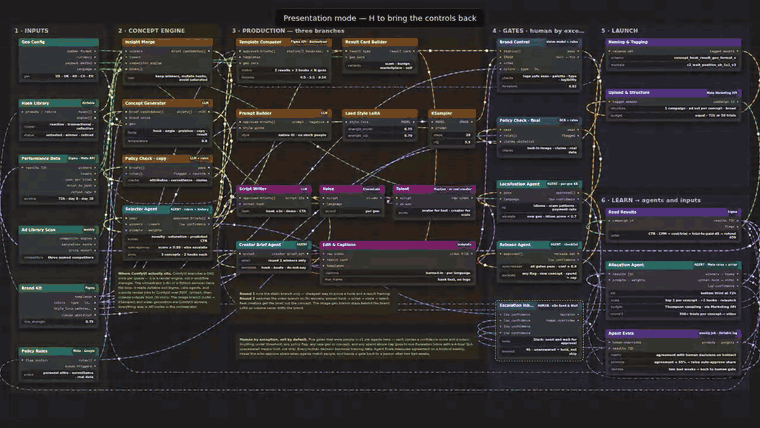
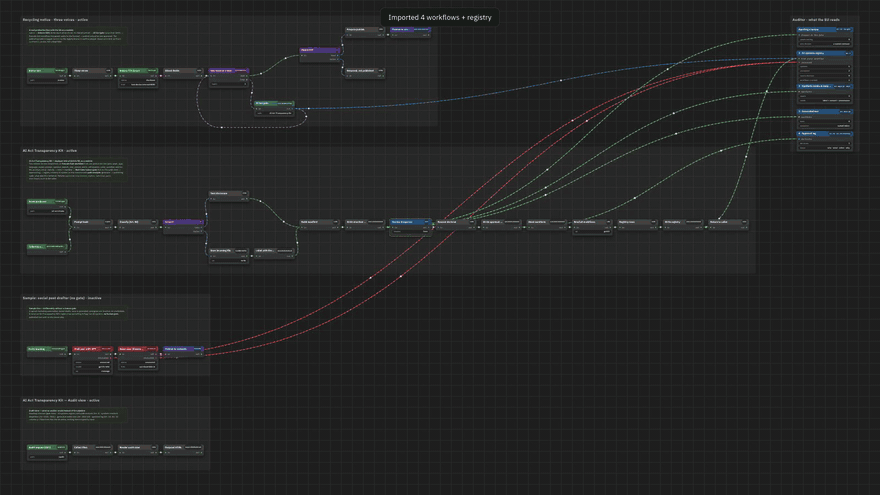

# Pipeline Map

A node-graph canvas for pitching a system before it exists. One HTML file, no build, no backend. Drag, rename, rewire, animate the flow, fly between saved camera views, record the screen.

**Live demo:** https://karusrus.github.io/pipeline-map/

## Why

When you sell an automation, a data pipeline or an AI workflow to someone who hasn't seen it yet, the artefact is usually a screenshot of n8n or a slide with boxes. Neither shows *what flows where*. This canvas borrows the visual language of ComfyUI — typed sockets, coloured wires, groups, widgets inside nodes — and adds the two things a pitch needs: motion along the wires, and a camera you can drive while you talk.

It was built in an evening for a creative-producer test assignment: a draft of how ad creative could be produced at volume for a subscription app, with agents running the gates and one human inbox for exceptions. That draft is the sample you see when you open the tool.

## What it does

- **Pan and zoom** — drag the canvas, wheel or pinch to zoom (12%–300%), `Fit` or `F` to frame everything.
- **Move** — drag a node by its title. Drag a group title and the group carries its nodes and notes.
- **Rename** — double-click any text: node title, badge, socket label, widget key or value, group title, note.
- **Rewire** — drag from an output dot to an input dot. Wire colour follows the output's type.
- **Delete** — select a node, wire, note or group and press `Delete`. `Ctrl+Z` undoes up to 60 steps.
- **Flow** — `Flow` or `A` animates traffic along every wire: dashes and particles move from output to input. Select a wire and press `1`, `2` or `3` to set how much runs through it.
- **Camera slots** — `1`–`5` fly to a saved view with a 0.9 s ease; `Shift+1`–`5` save the current view. Five slots ship pre-set for the sample.
- **Presentation mode** — `H` hides every panel. Nothing but the canvas, for recording.
- **Saves itself** — the layout persists in the browser (`localStorage`). `JSON` opens the layout as text to copy, keep or paste back in. `Reset draft` restores the sample.
- **Notes** — `+ Note` adds a sticky note on the canvas; double-click to edit.

## How to use it for a pitch

1. Open the file, `Reset draft` if you want the sample, or `+ Node` and build your own.
2. Set up three or four camera slots with `Shift+1…`: an opening close-up, the full map, the place where the argument lands.
3. Press `H`, then `A`. Start the screen recording. Walk the slots with the number keys; move one node while you talk so the audience sees the wires follow.

## Wire types

| Colour | Type |
|---|---|
| green | data |
| yellow | brief / copy |
| orange | static creative |
| pink | video |
| lavender | brand asset |
| blue | decision / gate |
| purple, dashed | feedback loop |

Types are just labels on sockets; edit the `T` map at the top of the script to define your own.

## Files

- `index.html` — the whole tool, ~40 KB, self-contained. Open it locally or host it anywhere static.
- `docs/` — preview GIF, MP4 and screenshots used in this README.

## Import from n8n

**Import n8n** (or drop the files on the canvas) takes one or more n8n workflow JSON exports and lays them out: positions from n8n, one group per workflow, sockets from each node's outputs (IF → true/false, Loop → done/loop), wire colours from what the node does, sticky notes as notes. Triggers, generators, human gates, publishing nodes and sub-workflow calls get their own colours.

Add the `registry.json` written by the [AI Act Transparency Kit](https://github.com/karusrus/transparency-kit) and the map paints every generator with its **path status** (`disclosed`, `editorial`, `verify`, `uncovered`, `likeness`, `internal`), wires the uncovered ones in red to an **Auditor** block on the right — what the EU reads: awaiting a human, the AI-systems registry, synthetic media and deep fakes, generated text, the approval log — and fills its counters from the registry. A line's call to the kit is drawn as a wire into the kit's entry node and a dashed return from *Return to caller*, so the embedding is visible; the kit's *Audit view* workflow sits under the Auditor block and reads the blocks (it renders files, it does not receive items). Five camera slots are set automatically: everything, then one per workflow, the auditor and its page last.

Live: [karusrus.github.io/pipeline-map/?import=docs/transparency-kit.bundle.json](https://karusrus.github.io/pipeline-map/?import=docs/transparency-kit.bundle.json) — four workflows and the registry of the kit's demo instance. Query parameters: `import=<url>`, `slot=<1–5>`, `pres=1` (no chrome), `flow=0`.

`docs/record.mjs` records the walkthrough through the camera slots with headless Chrome (DevTools screencast) and writes an MP4, a GIF and one still per slot — no screen recorder.

## Roadmap, if anyone asks

- Import ComfyUI workflow JSON the same way.
- Read a live n8n instance through its API instead of exported files.

If you would use them, open an issue and say so — that is the only thing that will get them built.

## Licence

MIT. Made by [Ruslan Karymov](https://karusrus.github.io) — design lead, creative automation, data-driven brand systems.
